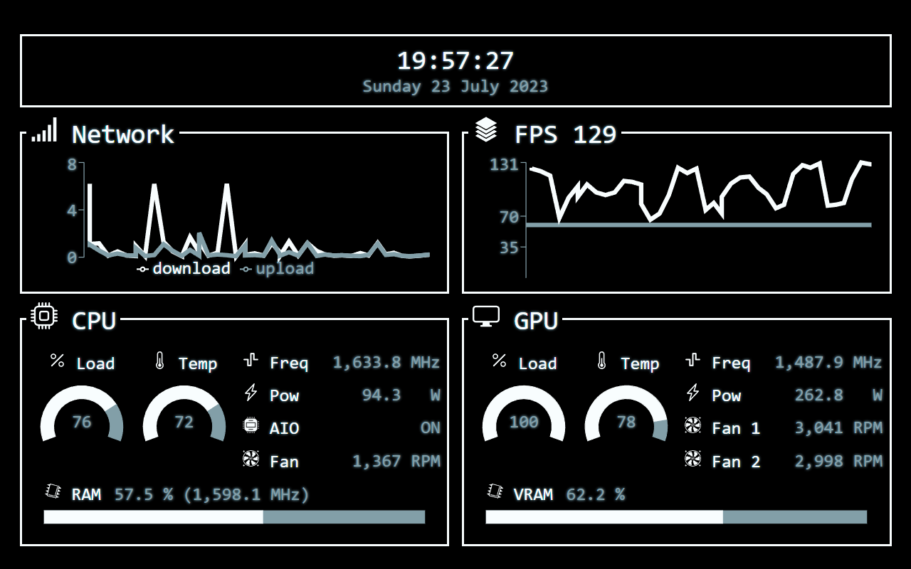

# pcdashboard
pcdashboard is a React application for displaying a PC's sensor readings from a REST endpoint.

## UI


## Running in development mode
To start the app in the development mode execute the following command:
```bash
npm start
```

Open [http://localhost:3000](http://localhost:3000) to view it in your browser.

The page will reload when you make changes. You may also see any lint errors in the console.

## Running the tests
Running the following command executes the test runner in the interactive watch mode.
```bash
npm test
```
See the section about [running tests](https://facebook.github.io/create-react-app/docs/running-tests) for more information.

## Building for production
Executing the following command:
```bash
npm run build
```

Builds the app for production to the `build` folder. It correctly bundles React in production mode and optimizes the build for the best performance.

The build is minified and the filenames include the hashes.
Your app is ready to be deployed!

See the section about [deployment](https://facebook.github.io/create-react-app/docs/deployment) for more information.

# Getting Started with Create React App

This project was bootstrapped with [Create React App](https://github.com/facebook/create-react-app).
